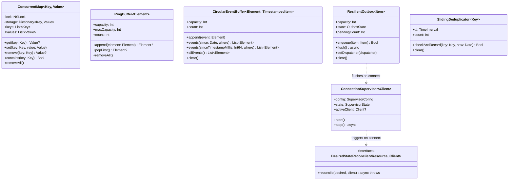
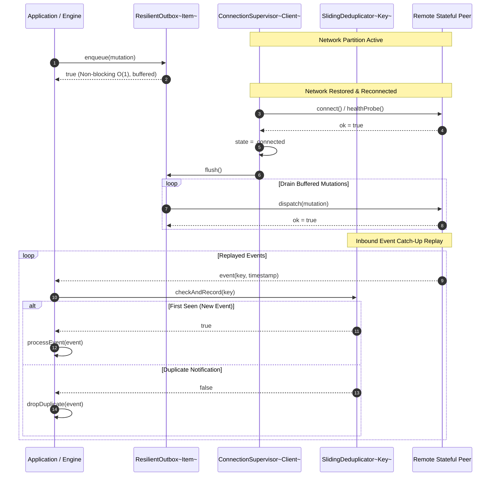
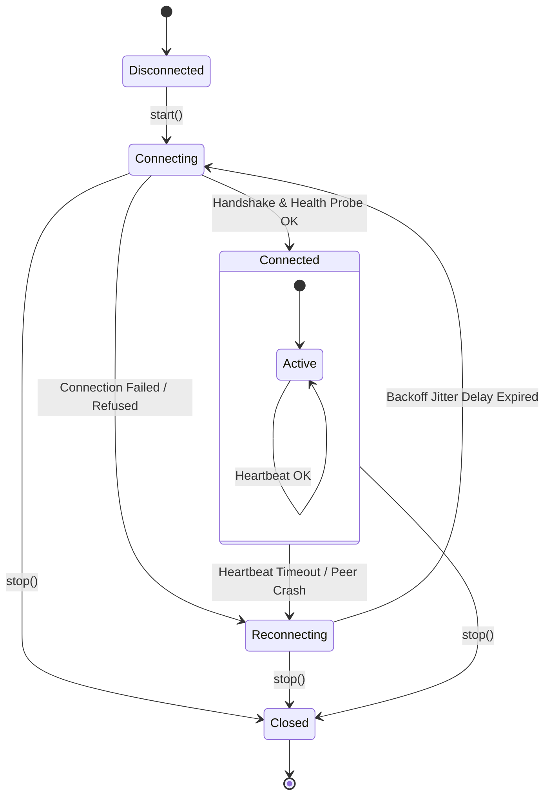
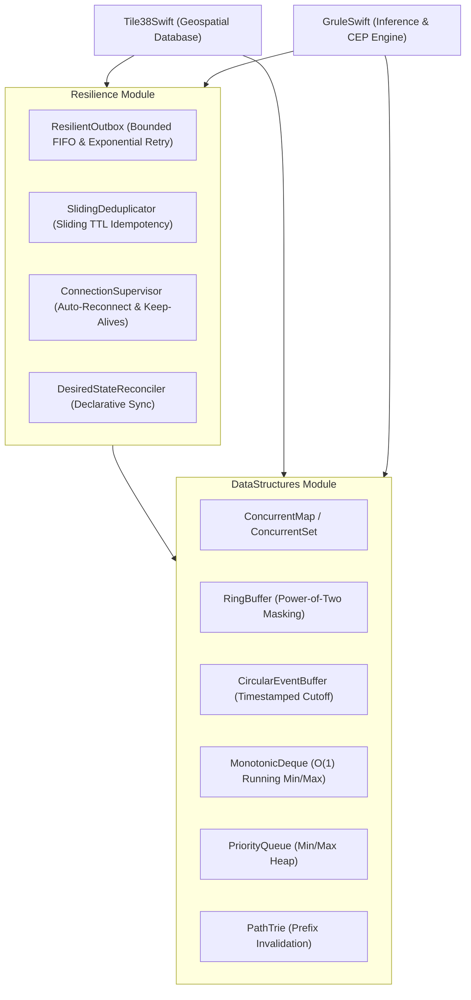

# DataStructuresSwift System Design Specification
## Document 01: Core Collections & Distributed Resilience Primitives

---

## 1. Executive Summary & Problem Domain

High-throughput distributed systems, real-time complex event processing (CEP) engines, and geospatial databases require two fundamental layers of foundation:
1. **Algorithmic Collections**: Specialized, cache-friendly, thread-safe data structures that avoid $O(N)$ memory shifting, linear search, or lock contention during high-velocity updates.
2. **Distributed Resilience Primitives**: Decoupled, non-blocking fault-tolerance patterns that isolate business execution from transient network partitions, process crashes, and at-least-once message duplicates.

**`DataStructuresSwift`** is a zero-dependency, pure Swift 6 library providing these shared building blocks to **`GruleSwift`**, **`Tile38Swift`**, and external microservices.

---

## 2. Multi-Perspective Architectural Diagrams

### 2.1 UML Class Diagram (`classDiagram`)

---

### 2.2 Sequence Diagram: Supervised Outbox Dispatch & Replay (`sequenceDiagram`)

---

### 2.3 State Transition Diagram (`stateDiagram-v2`)

---

### 2.4 Data Pipeline Flowchart (`flowchart TD`)

---

## 3. Subsystem Specifications

### 3.1 Collections
- **`ConcurrentMap` / `ConcurrentSet`**: Mutual exclusion via `NSLock`, supporting full dictionary API semantics without reader starvation.
- **`RingBuffer`**: Constant-time insertion with power-of-two bitmask indexing (`index & (capacity - 1)`), zero array shifting.
- **`CircularEventBuffer`**: Timestamped cutoff queries (`events(since:)`, `events(sinceTimestampMillis:)`) for zero-loss chronological replay.
- **`MonotonicDeque`**: Dual-ended queue enforcing strict element monotonicity for $O(1)$ running extremum window aggregation.
- **`PriorityQueue`**: Array-backed binary heap with configurable ordering (`.min`, `.max`).
- **`PathTrie`**: Tokenized property hierarchy prefix tree for $O(L)$ cache invalidation.

### 3.2 Resilience Primitives
- **`ResilientOutbox`**: Non-blocking asynchronous mutation buffer isolating transactional callers from network partitions, with bounded memory overflow eviction and exponential backoff retry (base 250ms, max 10s, ±20% jitter).
- **`SlidingDeduplicator`**: Sliding-window TTL cache evaluating deterministic fingerprints to guarantee exactly-once evaluation under at-least-once transport replay.
- **`ConnectionSupervisor`**: Long-running supervisor actor managing socket lifecycles, health probing, and auto-reconnect backoffs.
- **`DesiredStateReconciler`**: Declarative state convergence protocol ensuring registered entities (hooks, channels) survive remote service restarts.

---

## 4. Verification Matrix

| Target | Suites | Tests | Pass Rate | Warnings |
|---|---|---|---|---|
| `DataStructures` | 2 | 9 | 100% | 0 |
| `Resilience` | 1 | 5 | 100% | 0 |
| **Total** | **3** | **14** | **100%** | **0** |
