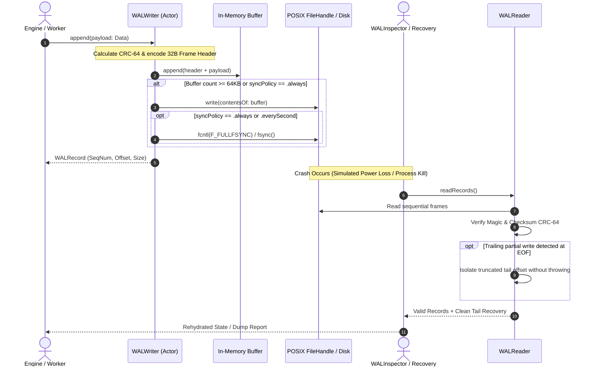
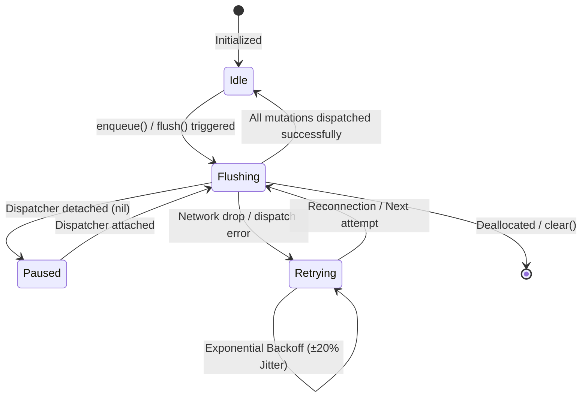
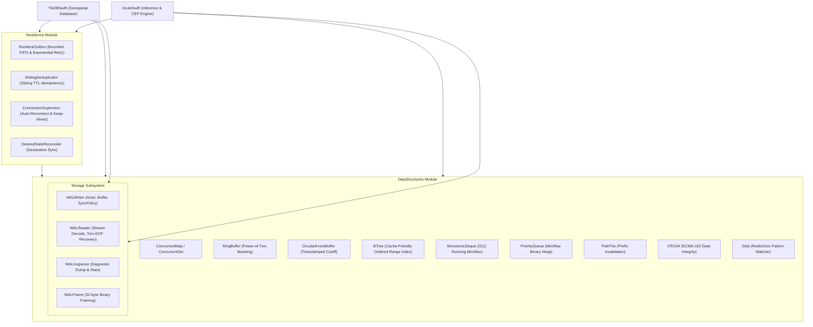

# DataStructuresSwift System Design Specification
## Document 01: Core Collections, Distributed Resilience & Unified WAL Storage

---

## 1. Executive Summary & Problem Domain

High-throughput distributed systems, real-time complex event processing (CEP) engines, and geospatial databases require three fundamental layers of foundation:
1. **Algorithmic Collections & Indexing**: Specialized, cache-friendly, thread-safe data structures that avoid $O(N)$ memory shifting, linear search, or lock contention during high-velocity updates.
2. **Distributed Resilience Primitives**: Decoupled, non-blocking fault-tolerance patterns that isolate business execution from transient network partitions, process crashes, and at-least-once message duplicates.
3. **Crash-Resilient Write-Ahead Log (WAL) Storage**: Generic append-only log engine with fixed-length binary framing, 64-bit CRC-64 verification, in-memory write buffering, configurable durability sync policies (`fsync`), torn EOF write recovery, and programmatic/diagnostic log inspection via `WALInspector`.

**`DataStructuresSwift`** is a zero-dependency, pure Swift 6 library providing these shared building blocks to **`GruleSwift`**, **`Tile38Swift`**, and external microservices.

---

## 2. Multi-Perspective Architectural Diagrams

### 2.1 UML Class Diagram (`classDiagram`)

```mermaid
classDiagram
    class ConcurrentMap~Key, Value~ {
        -lock: NSLock
        -storage: Dictionary~Key, Value~
        +get(key: Key) Value?
        +set(key: Key, value: Value)
        +remove(key: Key) Value?
        +contains(key: Key) Bool
        +keys: List~Key~
        +values: List~Value~
        +removeAll()
    }

    class RingBuffer~Element~ {
        +capacity: Int
        +maxCapacity: Int
        +count: Int
        +append(element: Element) Element?
        +popFirst() Element?
        +removeAll()
    }

    class CircularEventBuffer~Element: TimestampedItem~ {
        +capacity: Int
        +count: Int
        +append(event: Element)
        +events(since: Date, where) List~Element~
        +events(sinceTimestampMillis: Int64, where) List~Element~
        +allEvents() List~Element~
        +clear()
    }

    class BTree~Key, Value~ {
        +degree: Int
        +count: Int
        +insert(key: Key, value: Value) Value?
        +find(key: Key) Value?
        +remove(key: Key) Value?
        +scan(from: Key?, to: Key?, reverse: Bool) List~Element~
        +clear()
    }

    class PriorityQueue~Element~ {
        +count: Int
        +peek() Element?
        +push(element: Element)
        +pop() Element?
        +clear()
    }

    class CRC64 {
        <<enumeration>>
        +polynomial: UInt64
        +checksum(data: Data) UInt64
        +checksum(buffer: UnsafeRawBufferPointer) UInt64
        +update(crc: UInt64, with: Data) UInt64
    }

    class Glob {
        +pattern: String
        +matches(text: String) Bool
        +match(pattern: String, text: String)$ Bool
    }

    class WALWriter {
        +path: String
        +format: WALFormat
        +syncPolicy: WALSyncPolicy
        +magic: UInt32
        +bufferCapacity: Int
        +open()
        +append(payload: Data, timestamp: Date) WALRecord
        +flush()
        +close()
        +truncate()
    }

    class WALReader {
        +path: String
        +format: WALFormat
        +readAll() List~WALRecord~
        +readRecords(fromOffset) Tuple
    }

    class WALInspector {
        +path: String
        +summary() WALSummary
        +inspect(payloadDecoder) List~WALRecordInspection~
        +dump(verbose, payloadDecoder) String
    }

    class ResilientOutbox~Mutation~ {
        +capacity: Int
        +pendingCount: Int
        +state: OutboxState
        +setDispatcher(dispatcher)
        +enqueue(mutation: Mutation) Bool
        +flush()
        +clear()
    }

    class SlidingDeduplicator~Key~ {
        +ttl: TimeInterval
        +count: Int
        +isDuplicate(key: Key, now: Date) Bool
        +clear()
    }

    class ConnectionSupervisor {
        +state: SupervisorState
        +start()
        +stop()
    }

    CircularEventBuffer --> RingBuffer : encapsulates
    ResilientOutbox --> RingBuffer : internal buffer
    WALWriter --> CRC64 : frame checksum
    WALReader --> CRC64 : verifies checksum
    WALInspector --> WALReader : consumes
```

---

### 2.2 Sequence Diagram (`sequenceDiagram`): WAL Append, Flush & Crash Recovery

---

### 2.3 State Transition Diagram (`stateDiagram-v2`): Outbox Circuit State

---

### 2.4 Data Pipeline Flowchart (`flowchart TD`)

---

## 3. Subsystem Specifications

### 3.1 Collections & Indexing
- **`ConcurrentMap` / `ConcurrentSet`**: Mutual exclusion via `NSLock`, supporting full dictionary API semantics without reader starvation.
- **`RingBuffer`**: Constant-time insertion with power-of-two bitmask indexing (`index & (capacity - 1)`), zero array shifting.
- **`CircularEventBuffer`**: Timestamped cutoff queries (`events(since:)`, `events(sinceTimestampMillis:)`) for zero-loss chronological replay.
- **`BTree`**: High-fanout B-Tree with Copy-on-Write value semantics, contiguous node array layouts, bidirectional range scanning (`scan(from:to:)`), and `Sequence` conformance.
- **`MonotonicDeque`**: Dual-ended queue enforcing strict element monotonicity for $O(1)$ running extremum window aggregation.
- **`PriorityQueue`**: Array-backed binary heap with configurable ordering (`.min`, `.max`, or custom sort closure).
- **`PathTrie`**: Tokenized property hierarchy prefix tree for $O(L)$ cache invalidation.

### 3.2 Hashing & Integrity
- **`CRC64`**: Hardware-aligned 64-bit Cyclic Redundancy Check calculator utilizing the ECMA-182 polynomial (`0x42F0E1EBA9EA3693`) and precomputed 256-entry lookup table. Operates on `Data` and `UnsafeRawBufferPointer`.

### 3.3 Algorithms & Pattern Matching
- **`Glob`**: Zero-regex wildcard string matcher supporting Redis/Unix pattern conventions (`*`, `?`, `[abc]`, `[a-z]`, `[^0-9]`, backslash escaping).

### 3.4 Crash-Resilient Write-Ahead Log (WAL) Storage
- **`WALWriter`**: Actor-isolated append log writer with in-memory write buffering (64 KB default threshold) and `.everySecond` background timer `fsync` scheduling.
- **`WALReader`**: Streaming log reader validating 32-byte frame headers, sequence numbers, and CRC-64 checksums with automatic torn-write truncation recovery at EOF.
- **`WALInspector`**: Structural inspection utility providing metadata summaries (total records, byte count, sequence continuity, throughput), corruption status, and formatted table dumps.

### 3.5 Resilience Primitives
- **`ResilientOutbox`**: Non-blocking asynchronous mutation buffer isolating transactional callers from network partitions, with bounded memory overflow eviction and exponential backoff retry (base 250ms, max 10s, ±20% jitter).
- **`SlidingDeduplicator`**: Sliding-window TTL cache evaluating deterministic fingerprints to guarantee exactly-once evaluation under at-least-once transport replay.
- **`ConnectionSupervisor`**: Long-running supervisor actor managing socket lifecycles, health probing, and auto-reconnect backoffs.
- **`DesiredStateReconciler`**: Declarative state convergence protocol ensuring registered entities (hooks, channels) survive remote service restarts.

---

## 4. Verification Matrix

| Target | Suites | Tests | Pass Rate | Code Coverage | Warnings |
|---|---|---|---|---|---|
| `DataStructures` | 7 | 35 | 100% | 92.76% | 0 |
| `Resilience` | 1 | 5 | 100% | 95.20% | 0 |
| **Total** | **8** | **40** | **100%** | **>93%** | **0** |
