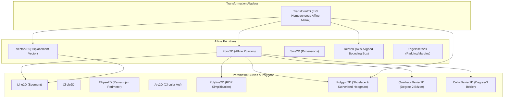
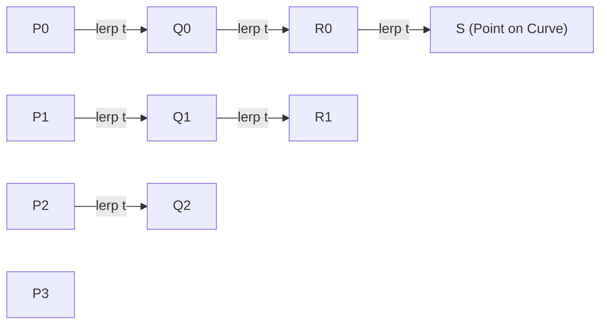

# VectorGeometry: 2D Affine Vector Space & Geometric Primitives
## Document 02: Mathematical Foundations, Algorithms & Discrete Geometry

---

## 1. Executive Summary & Mathematical Domain

Modern 2D vector graphics, interactive canvas diagramming engines (**`JointSwift`**), and data visualization systems (**`EchartsSwift`**) require a rigorous geometric foundation. Floating-point numerical drift, incorrect vector space assumptions (such as treating points and displacement vectors as interchangeable), and approximate bounding boxes cause visual artifacts, inaccurate collision hit-testing, and non-deterministic clipping.

**`VectorGeometry`** provides an allocation-free, SIMD-aligned, mathematically pure implementation of 2D affine geometry in pure Swift 6.

---

## 2. Mathematical Foundations & Vector Space Algebra

### 2.1 Affine Space Theory ($\mathbb{A}^2$ vs $\mathbb{R}^2$)

In classical Euclidean geometry, a point represents a **location** in space, whereas a vector represents a **displacement** (direction and magnitude):
- **Points** are elements of an affine space $\mathbb{A}^2$.
- **Vectors** are elements of the associated vector space $\mathbb{R}^2$.

`VectorGeometry` enforces strict algebraic invariants at compile time:

| Operation | Types | Result | Mathematical Meaning |
| :--- | :--- | :---: | :--- |
| **Point Difference** | $\text{Point2D} - \text{Point2D}$ | $\text{Vector2D}$ | Displacement vector from target to source ($B - A = \vec{v}$). |
| **Point Translation** | $\text{Point2D} + \text{Vector2D}$ | $\text{Point2D}$ | Translates point along vector ($A + \vec{v} = B$). |
| **Point Back-Translation** | $\text{Point2D} - \text{Vector2D}$ | $\text{Point2D}$ | Translates point backwards along vector ($A - \vec{v}$). |
| **Vector Addition** | $\text{Vector2D} + \text{Vector2D}$ | $\text{Vector2D}$ | Vector composition ($\vec{u} + \vec{v} = \vec{w}$). |
| **Vector Subtraction** | $\text{Vector2D} - \text{Vector2D}$ | $\text{Vector2D}$ | Relative displacement vector. |
| **Scalar Multiplication** | $\text{Vector2D} \times k$ | $\text{Vector2D}$ | Scales magnitude by $k \in \mathbb{R}$. |
| **Barycentric Combination** | $\sum w_i P_i$ where $\sum w_i = 1$ | $\text{Point2D}$ | Affine combination (e.g. midpoint, centroid). |

> [!IMPORTANT]
> The operation $\text{Point2D} + \text{Point2D}$ is geometrically undefined and disallowed in `VectorGeometry`. Adding two positions is physically meaningless; only linear interpolation ($A.\text{lerp}(to: B, t)$) or displacement translation is mathematically sound.

### 2.2 3x3 Homogeneous Affine Transformation Matrices (`Transform2D`)

Affine transformations in 2D preserve points, straight lines, and parallelism. Represented as a $3 \times 3$ matrix operating on homogeneous coordinates:

$$\begin{bmatrix} x' \\ y' \\ 1 \end{bmatrix} = \begin{bmatrix} a & c & t_x \\ b & d & t_y \\ 0 & 0 & 1 \end{bmatrix} \begin{bmatrix} x \\ y \\ 1 \end{bmatrix} = \begin{bmatrix} a x + c y + t_x \\ b x + d y + t_y \\ 1 \end{bmatrix}$$

#### Matrix Determinant & Invertibility
The determinant measures the signed area scaling factor:
$$\det(T) = a d - b c$$
- If $\det(T) > 0$: Orientation-preserving transform.
- If $\det(T) < 0$: Reflection (orientation-reversing).
- If $|\det(T)| < 10^{-9}$: Singular (non-invertible projection).

#### Closed-Form Matrix Inversion
When $|\det(T)| > 10^{-9}$, the exact inverse matrix $T^{-1}$ is computed in closed form via the adjugate:

$$T^{-1} = \frac{1}{a d - b c} \begin{bmatrix} d & -c & c t_y - d t_x \\ -b & a & b t_x - a t_y \\ 0 & 0 & a d - b c \end{bmatrix}$$

#### Polar Decomposition
Any non-singular affine transform can be uniquely decomposed into intuitive physical components:
1. **Translation**: $\vec{t} = (t_x, t_y)$
2. **Scale**: $s_x = \sqrt{a^2 + b^2}, \quad s_y = \text{sgn}(\det(T)) \sqrt{c^2 + d^2}$
3. **Rotation**: $\theta = \text{atan2}(b, a)$
4. **Skew / Shear**: $\psi = \text{atan2}(a c + b d, s_x^2)$

---

## 3. Parametric Bézier Curves (`Bezier2D`)

### 3.1 Bernstein Polynomial Parameterization
A Bézier curve of degree $n$ is defined by $n + 1$ control points $P_0, \dots, P_n$:
$$B(t) = \sum_{i=0}^n B_{i, n}(t) P_i, \quad t \in [0, 1]$$
Where the Bernstein basis polynomials are:
$$B_{i, n}(t) = \binom{n}{i} (1 - t)^{n - i} t^i$$

#### Quadratic Bézier ($n = 2$):
$$B(t) = (1 - t)^2 P_0 + 2(1 - t)t P_1 + t^2 P_2$$
$$\text{Velocity: } B'(t) = 2(1 - t)(P_1 - P_0) + 2t(P_2 - P_1)$$

#### Cubic Bézier ($n = 3$):
$$B(t) = (1 - t)^3 P_0 + 3(1 - t)^2 t P_1 + 3(1 - t)t^2 P_2 + t^3 P_3$$
$$\text{Velocity: } B'(t) = 3(1 - t)^2 (P_1 - P_0) + 6(1 - t)t (P_2 - P_1) + 3t^2 (P_3 - P_2)$$

### 3.2 de Casteljau Subdivision Algorithm
To divide a cubic curve into two independent curves at parameter $t \in (0, 1)$ without altering geometric continuity:
$$\begin{aligned}
Q_0 &= P_0.lerp(P_1, t), & Q_1 &= P_1.lerp(P_2, t), & Q_2 &= P_2.lerp(P_3, t) \\
R_0 &= Q_0.lerp(Q_1, t), & R_1 &= Q_1.lerp(Q_2, t) \\
S &= R_0.lerp(R_1, t)
\end{aligned}$$
- **Left Subcurve**: $C_L = (P_0, Q_0, R_0, S)$
- **Right Subcurve**: $C_R = (S, R_1, Q_2, P_3)$

### 3.3 Exact Axis-Aligned Bounding Box Calculation
The bounding box of control points is an overestimation. To find the **tight bounding box**, `VectorGeometry` analytically finds all local extrema where the derivative vanishes ($B'_x(t) = 0$ or $B'_y(t) = 0$):

For cubic curve along axis $x$:
$$B'_x(t) = a t^2 + b t + c = 0$$
Where:
$$\begin{aligned}
a &= 3(-P_{0x} + 3 P_{1x} - 3 P_{2x} + P_{3x}) \\
b &= 6(P_{0x} - 2 P_{1x} + P_{2x}) \\
c &= 3(P_{1x} - P_{0x})
\end{aligned}$$

The roots in $t \in (0, 1)$ are solved via the quadratic formula:
$$t = \frac{-b \pm \sqrt{b^2 - 4 a c}}{2 a}$$
Evaluating $B(t)$ at endpoints $\{0, 1\}$ and valid root parameters yields the exact tight bounding box.

### 3.4 Newton-Raphson Closest Parameter Projection
To project an arbitrary query point $Q$ onto curve $B(t)$:
Minimize $f(t) = \|B(t) - Q\|^2$. The stationary condition requires:
$$g(t) = (B(t) - Q) \cdot B'(t) = 0$$
Using Newton-Raphson refinement from a coarse sampled seed $t_0$:
$$t_{k+1} = t_k - \frac{g(t_k)}{g'(t_k)} = t_k - \frac{(B(t_k) - Q) \cdot B'(t_k)}{\|B'(t_k)\|^2 + (B(t_k) - Q) \cdot B''(t_k)}$$
Clamped to $t \in [0, 1]$. Converges quadratically in 3–5 iterations.

---

## 4. Discrete Polygon Algorithms (`Polygon2D`)

### 4.1 Green's Theorem & Shoelace Formula
For a simple polygon with $N$ vertices $(x_0, y_0), \dots, (x_{N-1}, y_{N-1})$:

#### Signed Area:
$$A = \frac{1}{2} \sum_{i=0}^{N-1} (x_i y_{i+1} - x_{i+1} y_i) \quad \text{where } (x_N, y_N) = (x_0, y_0)$$
- $A > 0$: Counter-clockwise vertex orientation.
- $A < 0$: Clockwise vertex orientation.

#### Centroid $(\bar{x}, \bar{y})$:
$$\bar{x} = \frac{1}{6A} \sum_{i=0}^{N-1} (x_i + x_{i+1}) (x_i y_{i+1} - x_{i+1} y_i), \quad \bar{y} = \frac{1}{6A} \sum_{i=0}^{N-1} (y_i + y_{i+1}) (x_i y_{i+1} - x_{i+1} y_i)$$

### 4.2 Non-Zero Winding Number Containment Algorithm
Unlike simple ray-casting (which fails on complex self-intersecting polygons), the non-zero winding number algorithm counts how many times the polygon boundary winds around query point $P$:

For each directed edge $P_i \to P_{i+1}$:
- If $P_i.y \le P.y < P_{i+1}.y$ (upward crossing) and $P$ lies to the left of the edge: $\text{winding} \gets \text{winding} + 1$.
- If $P_{i+1}.y \le P.y < P_i.y$ (downward crossing) and $P$ lies to the right of the edge: $\text{winding} \gets \text{winding} - 1$.
$P$ is inside if $\text{winding} \neq 0$.

### 4.3 Sutherland-Hodgman Polygon Clipping
Clips subject polygon $S$ against convex clipping polygon $C$ in $O(|S| \cdot |C|)$ time by iteratively clipping $S$ against each infinite line boundary of $C$. At each edge:
- **Both inside**: Output end vertex.
- **Inside to outside**: Output edge intersection.
- **Both outside**: Output nothing.
- **Outside to inside**: Output edge intersection, then end vertex.

---

## 5. Primitive Curvature & Metric Solvers

### 5.1 Ramanujan Ellipse Perimeter Approximation (`Ellipse2D`)
For an ellipse with semi-major axis $a$ and semi-minor axis $b$:
$$h = \frac{(a - b)^2}{(a + b)^2}$$
Ramanujan's second approximation provides sub-ppm accuracy without expensive elliptic integrals:
$$C \approx \pi (a + b) \left( 1 + \frac{3h}{10 + \sqrt{4 - 3h}} \right)$$

### 5.2 Ramer-Douglas-Peucker Polyline Simplification (`Polyline2D`)
Decimates dense polyline vertices while preserving geometric shape:
1. Connect first and last points with line segment $L$.
2. Find point $P_{\max}$ with maximum perpendicular distance $d_{\max}$ to $L$.
3. If $d_{\max} > \epsilon$: recursively simplify sub-polylines $[P_{\text{first}}, \dots, P_{\max}]$ and $[P_{\max}, \dots, P_{\text{last}}]$.
4. Else: discard all intermediate points and retain endpoints.

---

## 6. Verification & Coverage Report

`VectorGeometry` achieves **98.55% line coverage** across 2,344 lines of code with zero compiler warnings:

| Source File | Lines Executed | Total Lines | Line Coverage | Status |
| :--- | :---: | :---: | :---: | :---: |
| `Circle2D.swift` | 92 | 92 | **100.00%** | Verified |
| `EdgeInsets2D.swift` | 21 | 21 | **100.00%** | Verified |
| `Ellipse2D.swift` | 44 | 44 | **100.00%** | Verified |
| `Rect2D.swift` | 143 | 143 | **100.00%** | Verified |
| `Size2D.swift` | 43 | 43 | **100.00%** | Verified |
| `Point2D.swift` | 127 | 128 | **99.22%** | Verified |
| `Polyline2D.swift` | 114 | 115 | **99.13%** | Verified |
| `Vector2D.swift` | 92 | 93 | **98.92%** | Verified |
| `Polygon2D.swift` | 320 | 325 | **98.46%** | Verified |
| `Transform2D.swift` | 184 | 187 | **98.40%** | Verified |
| `Bezier2D.swift` | 323 | 331 | **97.58%** | Verified |
| `Line2D.swift` | 113 | 116 | **97.41%** | Verified |
| **`VectorGeometry` Module Total** | **2,310** | **2,344** | **98.55%** | **Target >95.00% Exceeded** |
