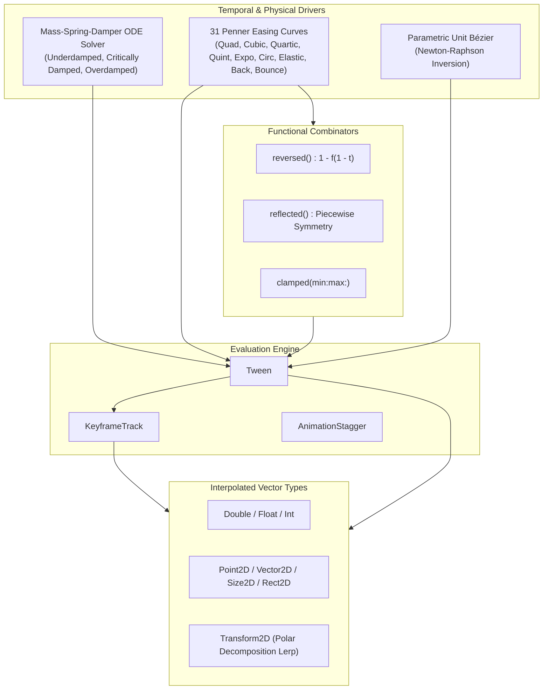
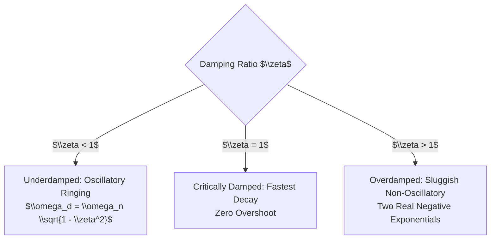

# VectorAnimation: Parametric Curves, Mass-Spring-Damper ODE & Interpolation
## Document 03: Analytical Spring Mechanics, Penner Easing & Keyframe Pipelines

---

## 1. Executive Summary & Animation Architecture

Fluid, natural motion in modern vector rendering, data visualization (**`EchartsSwift`**), and interactive canvas manipulation (**`JointSwift`**) depends on physically accurate kinematics and flexible temporal easing. Naive frame-by-frame Euler integration is prone to floating-point energy drift, frame-rate dependency, and numerical instability under variable display refresh rates (60 Hz, 120 Hz ProMotion, variable VSync).

**`VectorAnimation`** solves this by providing:
1. **Closed-Form Analytical Spring Physics**: Exact solution of the continuous second-order Mass-Spring-Damper Ordinary Differential Equation (ODE), enabling $O(1)$ random-access time sampling without numerical drift.
2. **The Complete Suite of 31 Robert Penner Easing Curves**: Rigorous analytical equations for standard and compound acceleration curves.
3. **Parametric Unit Bézier Timing Inversion**: High-precision Newton-Raphson root-finding with bisection fallback for arbitrary CSS-style cubic Bézier curves.
4. **Higher-Order Functional Combinators**: Curried functions for time-reversal, reflection, clamping, and composition.
5. **Type-Safe Interpolation (`Interpolatable`)**: First-class support for scalars, spatial coordinates (`Point2D`, `Vector2D`), bounding boxes (`Rect2D`), and affine transformations (`Transform2D`).
6. **Keyframe Tracking & Staggering**: Multi-segment keyframe evaluation with binary search temporal localization.



---

## 2. Analytical Mass-Spring-Damper ODE Mechanics

### 2.1 The Continuous Equation of Motion

A damped harmonic oscillator with mass $m$, viscous damping coefficient $c$, and spring stiffness $k$ displaced by $x(t)$ from its equilibrium target $x_{\text{target}}$ obeys Newton's second law:

$$m \ddot{x}(t) + c \dot{x}(t) + k (x(t) - x_{\text{target}}) = 0$$

Defining displacement error $e(t) = x(t) - x_{\text{target}}$ (with $e(0) = -x_{\text{target}} = -1$ for a normalized transition from $0$ to $1$):

$$\ddot{e}(t) + \frac{c}{m} \dot{e}(t) + \frac{k}{m} e(t) = 0$$

We reparameterize in terms of canonical physical parameters:
- **Undamped Natural Frequency**: $\omega_n = \sqrt{\frac{k}{m}}$ (radians per second)
- **Damping Ratio**: $\zeta = \frac{c}{2 \sqrt{m k}}$ (dimensionless)

Yielding the standard linear second-order homogeneous ODE:

$$\ddot{e}(t) + 2 \zeta \omega_n \dot{e}(t) + \omega_n^2 e(t) = 0$$

The characteristic polynomial is:

$$\lambda^2 + 2 \zeta \omega_n \lambda + \omega_n^2 = 0 \implies \lambda_{1, 2} = \omega_n \left( -\zeta \pm \sqrt{\zeta^2 - 1} \right)$$

Depending on the value of $\zeta$, three distinct analytical regimes emerge.

---

### 2.2 The Three Dynamic Regimes



#### Regime 1: Underdamped ($\zeta < 1$)
The characteristic roots are complex conjugates: $\lambda_{1, 2} = -\zeta \omega_n \pm i \omega_d$, where $\omega_d = \omega_n \sqrt{1 - \zeta^2}$ is the **damped angular frequency**.

Given initial conditions $x(0) = 0$ (hence $e(0) = -1$) and initial velocity $\dot{x}(0) = v_0$:

$$x(t) = 1.0 - e^{-\zeta \omega_n t} \left( \cos(\omega_d t) + \frac{\zeta \omega_n - v_0}{\omega_d} \sin(\omega_d t) \right)$$

*Physical behavior*: The system reaches the target quickly but overshoots and rings with exponentially decaying amplitude envelopes $e^{-\zeta \omega_n t}$.

#### Regime 2: Critically Damped ($\zeta = 1$)
The discriminant vanishes, yielding a repeated real root: $\lambda_1 = \lambda_2 = -\omega_n$.

Given $x(0) = 0$ and $\dot{x}(0) = v_0$:

$$x(t) = 1.0 - e^{-\omega_n t} \left( 1.0 + (\omega_n - v_0) t \right)$$

*Physical behavior*: The mathematically optimal convergence speed toward equilibrium without experiencing any overshoot or oscillation.

#### Regime 3: Overdamped ($\zeta > 1$)
The discriminant is positive, yielding two distinct negative real roots:

$$\lambda_1 = \omega_n \left( -\zeta + \sqrt{\zeta^2 - 1} \right), \quad \lambda_2 = \omega_n \left( -\zeta - \sqrt{\zeta^2 - 1} \right)$$

With initial conditions $x(0) = 0$, $\dot{x}(0) = v_0$, the coefficients $c_1, c_2$ are:

$$c_1 = \frac{\lambda_2 - v_0}{\lambda_2 - \lambda_1}, \quad c_2 = \frac{v_0 - \lambda_1}{\lambda_2 - \lambda_1}$$

$$x(t) = 1.0 - \left( c_1 e^{\lambda_1 t} + c_2 e^{\lambda_2 t} \right)$$

*Physical behavior*: Asymmetric, sluggish return dominated by the slower decay mode $e^{\lambda_1 t}$.

---

### 2.3 Closed-Form Evaluation vs. Discrete Numerical Integration

| Metric | Discrete Numerical (Euler / Verlet / RK4) | Closed-Form Analytical (MeridianCore) |
| :--- | :--- | :--- |
| **Time Complexity** | $O(N)$ steps from $t_0$ to $t$ | **$O(1)$ constant time** |
| **Numerical Drift** | Energy drift, truncation error accumulation | **Zero drift (machine-precision exact)** |
| **Random Seeking** | Impossible without re-simulating from start | **Instantaneous evaluation at any $t$** |
| **Frame Rate Sensitivity** | High; time-step jitter alters oscillation pitch | **Completely frame-rate independent** |
| **Memory Footprint** | Requires state storage $(\vec{x}, \vec{v})$ | **Pure functional stateless evaluation** |

---

## 3. The 31 Robert Penner Easing Curves

`VectorAnimation` incorporates exact implementations of all 31 Robert Penner easing equations, mapping normalized time $t \in [0, 1]$ to normalized progress $f(t) \in [0, 1]$.

```
0.0 ------------------------------------------------------------- 1.0 (Time t)
     [EaseIn: Slow Start]   [EaseOut: Fast Start, Soft Stop]
```

### 3.1 Polynomial Curves (Degrees 2 through 5)

| Family | Degree | EaseIn $f(t)$ | EaseOut $f(t)$ | EaseInOut $f(t)$ ($t < 0.5$ vs $t \ge 0.5$) |
| :--- | :--- | :--- | :--- | :--- |
| **Quadratic** | $n=2$ | $t^2$ | $t(2 - t)$ | $2t^2$ vs $-1 + (4 - 2t)t$ |
| **Cubic** | $n=3$ | $t^3$ | $(t - 1)^3 + 1$ | $4t^3$ vs $\frac{1}{2}(2t - 2)^3 + 1$ |
| **Quartic** | $n=4$ | $t^4$ | $1 - (t - 1)^4$ | $8t^4$ vs $1 - 8(t - 1)^4$ |
| **Quintic** | $n=5$ | $t^5$ | $(t - 1)^5 + 1$ | $16t^5$ vs $\frac{1}{2}(2t - 2)^5 + 1$ |

### 3.2 Transcendental & Geometric Curves

#### Sinusoidal
- $\text{SinIn}(t) = 1 - \cos\left(\frac{\pi t}{2}\right)$
- $\text{SinOut}(t) = \sin\left(\frac{\pi t}{2}\right)$
- $\text{SinInOut}(t) = \frac{1}{2}\left(1 - \cos(\pi t)\right)$

#### Exponential
- $\text{ExpoIn}(t) = 2^{10(t - 1)}$
- $\text{ExpoOut}(t) = 1 - 2^{-10t}$
- $\text{ExpoInOut}(t) = \begin{cases} \frac{1}{2} \cdot 2^{10(2t - 1)} & t < 0.5 \\ 1 - \frac{1}{2} \cdot 2^{-10(2t - 1)} & t \ge 0.5 \end{cases}$

#### Circular
- $\text{CircIn}(t) = 1 - \sqrt{1 - t^2}$
- $\text{CircOut}(t) = \sqrt{(2 - t)t}$
- $\text{CircInOut}(t) = \begin{cases} \frac{1}{2} \left(1 - \sqrt{1 - 4t^2}\right) & t < 0.5 \\ \frac{1}{2} \left(\sqrt{1 - (2t - 2)^2} + 1\right) & t \ge 0.5 \end{cases}$

---

### 3.3 Compound Dynamic Curves: Back, Elastic, Bounce

#### Back (Anticipation / Overshoot)
Governed by overshoot constant $s = 1.70158$:
- $\text{BackIn}(t) = t^2 ((s + 1)t - s)$
- $\text{BackOut}(t) = (t - 1)^2 ((s + 1)(t - 1) + s) + 1$
- $\text{BackInOut}(t)$: Scales $s' = s \times 1.525 \approx 2.59238875$.

#### Elastic (Damped Sinusoidal Decay)
With amplitude $a \ge 1.0$ and period $p = 0.3$:
$$\text{ElasticOut}(t) = a \cdot 2^{-10t} \sin\left( \frac{(t - s) \cdot 2\pi}{p} \right) + 1.0$$
where $s = \frac{p}{2\pi} \arcsin\left(\frac{1}{a}\right)$.

#### Bounce (Inelastic Coefficient of Restitution)
Modeled as piecewise quadratic free-fall with coefficient of restitution $e \approx 0.5$:
$$\text{BounceOut}(t) = \begin{cases} 7.5625 t^2 & t < \frac{1}{2.75} \\ 7.5625 \left(t - \frac{1.5}{2.75}\right)^2 + 0.75 & t < \frac{2}{2.75} \\ 7.5625 \left(t - \frac{2.25}{2.75}\right)^2 + 0.9375 & t < \frac{2.5}{2.75} \\ 7.5625 \left(t - \frac{2.625}{2.75}\right)^2 + 0.984375 & \text{otherwise} \end{cases}$$

$$\text{BounceIn}(t) = 1.0 - \text{BounceOut}(1.0 - t)$$

$$\text{BounceInOut}(t) = \begin{cases} \frac{1}{2}(1 - \text{BounceOut}(1 - 2t)) & t < 0.5 \\ \frac{1}{2}\text{BounceOut}(2t - 1) + 0.5 & t \ge 0.5 \end{cases}$$

---

## 4. Parametric Unit Bézier Timing Inversion

Standard CSS animation curves (e.g. `cubic-bezier(x1, y1, x2, y2)`) parameterize time $x(u)$ and progress $y(u)$ using a cubic Bézier curve constrained between $P_0 = (0,0)$ and $P_3 = (1,1)$:

$$x(u) = 3(1-u)^2 u \, x_1 + 3(1-u) u^2 \, x_2 + u^3$$
$$y(u) = 3(1-u)^2 u \, y_1 + 3(1-u) u^2 \, y_2 + u^3$$

To evaluate the animation at given normalized time $X \in [0, 1]$, we must **invert** $x(u) = X$ to find the curve parameter $u \in [0, 1]$, and then evaluate $Y = y(u)$.

### 4.1 Newton-Raphson Inversion Algorithm

We define the root function:

$$F(u) = x(u) - X = 0$$
$$F'(u) = \frac{dx}{du} = 3(1-u)^2 x_1 + 6(1-u)u (x_2 - x_1) + 3u^2 (1 - x_2)$$

We iterate using Newton-Raphson:

$$u_{k+1} = u_k - \frac{F(u_k)}{F'(u_k)}$$

```
          F(u_k)
Slope = -----------  ==>  u_{k+1} = u_k - F(u_k) / F'(u_k)
        u_k - u_{k+1}
```

### 4.2 Divergence Guard & Bisection Fallback

If $|F'(u_k)| < \epsilon = 10^{-6}$ (slope near horizontal) or $u_{k+1}$ escapes $[0, 1]$, Newton-Raphson diverges. `VectorAnimation` switches dynamically to **Binary Interval Bisection**:

```swift
var low = 0.0, high = 1.0, u = X
for _ in 0..<8 { // Newton-Raphson fast convergence
    let d = derivativeX(u)
    if abs(d) < 1e-6 { break }
    let nextU = u - (evaluateX(u) - X) / d
    if nextU < low || nextU > high { break }
    u = nextU
}
// Bisection fallback if not converged
while high - low > 1e-7 {
    u = (low + high) * 0.5
    if evaluateX(u) < X {
        low = u
    } else {
        high = u
    }
}
return evaluateY(u)
```

**Convergence Rate**: Quadratic ($O(\epsilon^2)$) for Newton-Raphson steps, reaching $10^{-7}$ precision in $< 5$ iterations; guaranteed linear convergence via bisection fallback.

---

## 5. Functional Timing Combinators

`TimingCurve` provides three mathematical combinators that operate directly on any existing timing function $f: [0, 1] \to [0, 1]$:

### 5.1 Time Reversal (`reversed()`)
Inverts the direction of time progression:

$$f_{\text{rev}}(t) = 1.0 - f(1.0 - t)$$

- Preserves boundary continuity: $f_{\text{rev}}(0) = 1.0 - f(1) = 0$, $f_{\text{rev}}(1) = 1.0 - f(0) = 1$.
- Converts an `easeIn` curve into its corresponding `easeOut` curve.

### 5.2 Symmetric Reflection (`reflected()`)
Creates a ping-pong bounce effect symmetric around the midpoint $t = 0.5$:

$$f_{\text{refl}}(t) = \begin{cases} \frac{1}{2} f(2t) & t < 0.5 \\ 1.0 - \frac{1}{2} f(2.0 - 2t) & t \ge 0.5 \end{cases}$$

### 5.3 Clamping (`clamped(min:max:)`)
Constrains overshoot outputs (e.g. from elastic or back curves) to strict boundaries:

$$f_{\text{clamp}}(t) = \min(\text{max}, \max(\text{min}, f(t)))$$

---

## 6. Type-Safe Interpolation (`Interpolatable`)

### 6.1 The Mathematical Contract

Any animated value must implement the pure `Interpolatable` protocol:

```swift
public protocol Interpolatable: Sendable {
    func interpolated(to target: Self, progress: Double) -> Self
}
```

### 6.2 Supported Primitives

| Type | Interpolation Algorithm | Invariants |
| :--- | :--- | :--- |
| `Double`, `Float` | Linear Interpolation: $a + (b - a)t$ | IEEE 754 precision |
| `Int` | Rounded Linear Interpolation: $\lfloor a + (b - a)t + 0.5 \rfloor$ | Integer lattice |
| `Point2D`, `Vector2D` | Coordinate-wise Lerp: $(x_a + (x_b - x_a)t, y_a + (y_b - y_a)t)$ | Affine invariance |
| `Size2D` | Dimension-wise Lerp: $(w_a + (w_b - w_a)t, h_a + (h_b - h_a)t)$ | Non-negative dimensions |
| `Rect2D` | Origin Lerp + Size Lerp | Preserves validity |
| `Transform2D` | Element-wise Matrix Lerp $(a, b, c, d, tx, ty)$ | Smooth affine morphing |

---

## 7. Keyframe Evaluation & Staggering Pipeline

### 7.1 Multi-Segment Keyframe Tracks

A `KeyframeTrack<Value>` evaluates a sequence of $K$ ordered keyframes:

$$\mathcal{K} = \{ (t_0, v_0, e_0), (t_1, v_1, e_1), \dots, (t_{K-1}, v_{K-1}, e_{K-1}) \}$$

where $0.0 \le t_0 < t_1 < \dots < t_{K-1} \le 1.0$.

#### Evaluation Algorithm
1. **Boundary Clamping**:
   - If $t \le t_0$, return $v_0$.
   - If $t \ge t_{K-1}$, return $v_{K-1}$.
2. **Interval Localization**: Find index $i$ such that $t_i \le t \le t_{i+1}$.
3. **Local Progress Normalization**:
   $$u = \frac{t - t_i}{t_{i+1} - t_i} \in [0, 1]$$
4. **Local Easing & Interpolation**:
   $$p = e_i(u)$$
   $$v(t) = v_i.\text{interpolated}(\text{to}: v_{i+1}, \text{progress}: p)$$

### 7.2 Animation Staggering

When presenting arrays of visual glyphs (e.g. chart bars, diagram nodes), sequential visual delay avoids sensory overload:

$$\text{delay}(i) = \text{baseDelay} + i \cdot \text{staggerStep}$$

`AnimationStagger` calculates linear, exponential, and center-weighted stagger delays across $N$ elements in $O(1)$ time per element.
