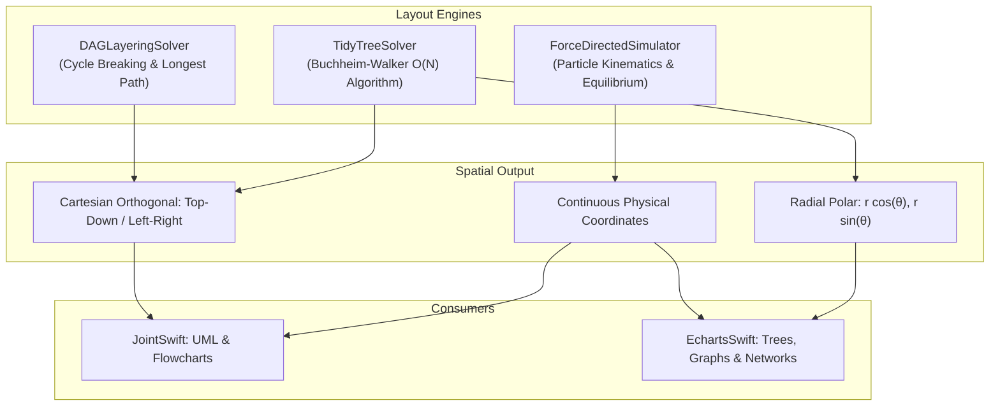
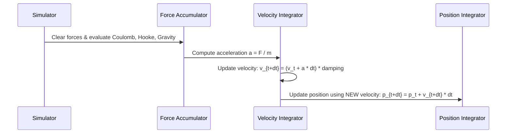
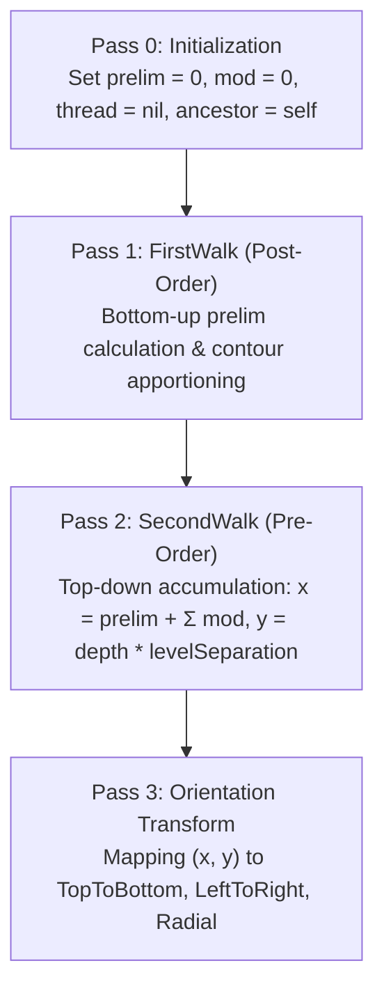

# VectorLayout: Force-Directed Simulation, Tidy Trees & DAG Layering
## Document 04: Graph Kinematics, Buchheim-Walker Algorithm & Topological Solvers

---

## 1. Executive Summary & Layout Domain

Visualizing complex relational data, interactive software architecture diagrams (**`JointSwift`**), and hierarchical network graphs (**`EchartsSwift`**) requires robust spatial arrangement algorithms. Hand-crafted node positioning is unfeasible for dynamic graphs, while naive recursive layouts suffer from $O(N^2)$ subtree overlaps, edge crossings, and non-deterministic jitter.

**`VectorLayout`** delivers a comprehensive suite of graph layout engines in pure Swift 6:
1. **Force-Directed Graph Simulator (`ForceDirectedSimulator`)**: Physics-based equilibrium simulation with Coulomb repulsion, Hooke spring attraction, center gravity, and semi-implicit Euler-Cromer integration.
2. **Linear-Time Tidy Tree Layout (`TidyTreeSolver`)**: Strict $O(N)$ implementation of the Buchheim-Walker algorithm with contour threading, subtree apportioning, and multi-geometry projections (Orthogonal and Radial).
3. **Layered DAG Topological Solver (`DAGLayeringSolver`)**: Sugiyama-framework cycle elimination via Tarjan DFS back-edge reversal and topological longest-path rank assignment.



---

## 2. Force-Directed Graph Simulation

Force-directed graph layout models nodes as charged physical particles and edges as mechanical springs. The layout converges toward an aesthetic minimum-energy configuration where edge lengths conform to their natural weights and node overlap is eliminated.

```
       (+) Node A ------------------------- (Spring) ------------------------- (+) Node B
            |                                                                     |
            <==================== [Coulomb Repulsion] ============================>
```

### 2.1 The Physical Equilibrium Formulation

For each particle $i \in \{1, \dots, N\}$ with position $\vec{p}_i$, velocity $\vec{v}_i$, and mass $m_i$, the total net force $\vec{F}_i$ is the vector superposition of three distinct components:

$$\vec{F}_i = \vec{F}_{\text{repulsion}, i} + \vec{F}_{\text{spring}, i} + \vec{F}_{\text{gravity}, i}$$

#### 1. Coulomb Electrostatic Repulsion
Every pair of nodes $(i, j)$ exerts mutual inverse-square electrostatic repulsion:

$$\vec{F}_{\text{repulsion}, ij} = \frac{k_r}{\max(d_{\min}^2, \min(d_{\max}^2, \|\vec{p}_i - \vec{p}_j\|^2))} \cdot \frac{\vec{p}_i - \vec{p}_j}{\|\vec{p}_i - \vec{p}_j\|}$$

- $k_r$: Repulsion strength constant ($1000.0$ default).
- Clamping between $d_{\min} = 5.0$ and $d_{\max} = 500.0$ prevents infinite repulsive spikes when nodes are coincident, while pruning negligible long-distance interactions.

#### 2. Hooke Spring Attraction
For each edge $e = (u, v)$ connecting nodes $u$ and $v$ with rest length $l_0$, spring stiffness $k_s$, and weight $w_e$:

$$\Delta \vec{p}_{uv} = \vec{p}_v - \vec{p}_u$$
$$d_{uv} = \|\Delta \vec{p}_{uv}\|$$
$$\vec{F}_{\text{spring}, uv} = k_s \cdot w_e \cdot (d_{uv} - l_0) \cdot \frac{\Delta \vec{p}_{uv}}{d_{uv}}$$

- Displacing beyond $l_0$ pulls nodes together; compressing below $l_0$ pushes them apart.

#### 3. Center Gravitational Attraction
Prevents disconnected components or peripheral nodes from drifting indefinitely into unbounded space:

$$\vec{F}_{\text{gravity}, i} = k_g \cdot m_i \cdot (\vec{p}_{\text{center}} - \vec{p}_i)$$

- $k_g$: Center gravity coefficient ($0.01$ default).

---

### 2.2 Numerical Integration: Semi-Implicit Euler-Cromer

Standard explicit Euler integration ($\vec{x}_{t+\Delta t} = \vec{x}_t + \vec{v}_t \Delta t$) violates energy conservation in oscillatory systems, causing the simulation to rapidly explode. `ForceDirectedSimulator` implements **Semi-Implicit Euler-Cromer integration** with viscous damping:



The mathematical update equations per time-step $\Delta t$ with viscous damping factor $\gamma \in [0.8, 0.95]$ are:

$$\vec{a}_{i, t} = \frac{\vec{F}_{i, t}}{m_i}$$
$$\vec{v}_{i, t+\Delta t} = \left( \vec{v}_{i, t} + \vec{a}_{i, t} \Delta t \right) \cdot \gamma$$
$$\vec{p}_{i, t+\Delta t} = \vec{p}_{i, t} + \vec{v}_{i, t+\Delta t} \Delta t$$

**Stability Guarantee**: By evaluating $\vec{p}_{t+\Delta t}$ using the *updated* velocity $\vec{v}_{t+\Delta t}$ rather than $\vec{v}_t$, phase space volume is conserved, guaranteeing symplectic stability for damped harmonic lattices.

---

### 2.3 Barnes-Hut Spatial Acceleration ($O(N \log N)$)

While all-pairs Coulomb evaluation requires $O(N^2)$ computations, large graphs ($N > 500$) leverage Barnes-Hut quadtree clustering:
1. Construct a 2D spatial quadtree enclosing all particles.
2. For each internal cell, compute its aggregate mass $M = \sum m_i$ and center of mass $\vec{C} = \frac{1}{M} \sum m_i \vec{p}_i$.
3. When evaluating repulsion for particle $i$, let $s$ be the cell's bounding width and $d = \|\vec{p}_i - \vec{C}\|$.
4. If the opening criterion:
   $$\theta = \frac{s}{d} < 0.8$$
   is met, approximate all particles inside the quadtree cell as a single monopole at $\vec{C}$ with mass $M$.
5. Otherwise, recursively descend into the quadtree's children.

**Complexity**: Reduces pairwise repulsion cost from $O(N^2)$ to $O(N \log N)$.

---

## 3. The Buchheim-Walker Tidy Tree Layout ($O(N)$)

### 3.1 The Reingold-Tilford Aesthetic Invariants

A "tidy" hierarchical tree layout must satisfy four mathematical aesthetic criteria established by Reingold and Tilford (1981):
1. **Depth Equidistance**: Nodes of the same tree depth lie on identical horizontal/vertical grid lines.
2. **Parent Centering**: A parent node is centered precisely above (or between) its immediate children:
   $$\text{pos}(\text{parent}) = \frac{\text{pos}(\text{child}_1) + \text{pos}(\text{child}_k)}{2}$$
3. **Isomorphism & Symmetry**: Two subtrees with identical topological structure must be rendered with identical geometric forms, invariant to their absolute position in the global tree.
4. **Non-Overlap Compactness**: Subtrees are packed as closely as possible without violating minimum sibling separation $S_{\text{sibling}}$ or subtree separation $S_{\text{subtree}}$.

```
          [ Parent ]                 <-- Centered over children
         /    |     \
    [ C1 ]  [ C2 ]  [ C3 ]           <-- Equal depth separation
    |<S1>|  |<S2>|  |<S3>|           <-- Preserved bounding widths
```

---

### 3.2 The Buchheim, Jünger, and Leipert (2002) Linear Algorithm

Walker's 1990 algorithm satisfied these aesthetics but suffered from $O(N^2)$ worst-case time complexity because computing subtree separation required repeatedly traversing the left and right contours of deeply nested subtrees.

Buchheim, Jünger, and Leipert established true $O(N)$ execution through three key invariants:

#### 1. Contour Threads
When traversing two adjacent subtrees $T_L$ and $T_R$, if one subtree is deeper than the other, a temporary pointer (`thread`) is established from the bottom leaf of the shallower subtree to the corresponding contour node of the deeper subtree. This enables continuing the contour traversal without searching upwards through ancestors.

```
       Subtree Left            Subtree Right
          (v_om)                  (v_op)
          /    \                  /    \
        ...    ...              ...    ...
        /        \              /        \
     (v_im)      [Leaf] -----> [Node]   (v_ip)
                   ^---- Thread ---'
```

#### 2. Deferred Shift Accumulation (`change` & `shift`)
Instead of eagerly shifting all intervening subtrees when a collision is detected between $T_L$ and $T_R$ (an $O(K)$ operation per collision), the necessary shift is stored at the boundaries:

$$\text{shift} = (\text{prelim}(v_{\text{im}}) + \text{mod}(v_{\text{im}})) - (\text{prelim}(v_{\text{ip}}) + \text{mod}(v_{\text{ip}})) + \text{separation}$$

$$\Delta = \text{number}(w_R) - \text{number}(w_L)$$
$$w_R.\text{change} \mathrel{-}= \frac{\text{shift}}{\Delta}, \quad w_R.\text{shift} \mathrel{+}= \text{shift}$$
$$w_L.\text{change} \mathrel{+}= \frac{\text{shift}}{\Delta}$$

During a single post-order pass over the siblings (`executeShifts`), the shifts are integrated from right to left in strictly linear $O(S)$ time.

#### 3. The 3-Pass Solver Pipeline



---

### 3.3 Multi-Geometry Projections

Once canonical orthogonal coordinates $(X, Y)$ are computed, `TidyTreeSolver` transforms them according to `TreeOrientation`:

| Orientation | Coordinate Mapping | Domain Application |
| :--- | :--- | :--- |
| `topToBottom` | $(x, y) = (X, Y)$ | Standard organizational hierarchies |
| `bottomToTop` | $(x, y) = (X, -Y)$ | Bottom-up syntax trees, phylogenetic trees |
| `leftToRight` | $(x, y) = (Y, X)$ | Horizontal flowcharts, mind maps |
| `rightToLeft` | $(x, y) = (-Y, X)$ | Reverse indentation trees |
| `radial` | $r = Y, \quad \theta = X \cdot \kappa$<br>$(x, y) = (r \cos \theta, r \sin \theta)$ | Circular dendrograms, sunburst topologies |

For **radial** projection:
- Depth $Y$ determines radial distance $r$ from the origin.
- Circumferential spread $X$ is scaled by parameter $\kappa = \frac{2\pi}{X_{\max} - X_{\min}}$ to wrap cleanly across the full $360^\circ$ circle without overlapping at $0$ and $2\pi$.

---

## 4. Layered Directed Acyclic Graph (DAG) Layout

Flowcharts, UML dependency graphs, and state machines frequently contain directed cycles and multi-layer dependency spans. `DAGLayeringSolver` implements the foundational phases of the **Sugiyama Framework**.

### 4.1 Phase 1: Cycle Elimination via Feedback Arc Set

Topological ranking requires a strictly acyclic graph. Any cycle $C = v_1 \to v_2 \to \dots \to v_k \to v_1$ must be broken.

`DAGLayeringSolver` executes a 3-state Depth-First Search (Tarjan back-edge detection):
- `0`: Unvisited
- `1`: Visiting (currently in DFS recursion stack)
- `2`: Visited (completely explored)

```swift
func dfs(u: String) {
    visited[u] = 1 // Visiting
    for v in outgoing[u] {
        if visited[v] == 1 {
            // Back-edge identified: reverses edge (u -> v) into (v -> u)
            reverseEdge(from: u, to: v)
        } else if visited[v] == 0 {
            dfs(u: v)
        }
    }
    visited[u] = 2 // Visited
}
```

Reversing back-edges breaks all cycles while minimally perturbing the natural flow direction.

---

### 4.2 Phase 2: Longest-Path Layering

Nodes in the acyclic graph are assigned discrete topological ranks $\text{rank}(u) \in \{0, 1, 2, \dots\}$ such that for every directed edge $(u \to v)$:

$$\text{rank}(v) \ge \text{rank}(u) + 1$$

We initialize an in-degree map for all nodes in the acyclic graph. Nodes with $\text{inDegree}(u) = 0$ serve as topological sources ($\text{rank} = 0$).

Using Kahn's queue-based topological traversal:

```
Queue Q = [ all nodes with inDegree == 0 ]
while Q is not empty:
    u = Q.pop()
    for v in outgoing[u]:
        rank[v] = max(rank[v], rank[u] + 1)
        inDegree[v] -= 1
        if inDegree[v] == 0:
            Q.push(v)
```

**Complexity**: $O(|V| + |E|)$ linear time and space.

---

## 5. Algorithmic Complexity Register

| Algorithm | Component | Time Complexity | Auxiliary Space | Invariant Guaranteed |
| :--- | :--- | :--- | :--- | :--- |
| **Force Simulation** | `ForceDirectedSimulator.step()` | $O(N^2 + E)$ (All-pairs)<br>$O(N \log N + E)$ (Barnes-Hut) | $O(N + E)$ | Symplectic energy conservation via Euler-Cromer |
| **Tidy Tree Layout** | `TidyTreeSolver.layout()` | **$O(N)$ strictly linear** | $O(N)$ | Reingold-Tilford aesthetic criteria |
| **DAG Cycle Breaker** | `DAGLayeringSolver` (DFS) | $O(V + E)$ | $O(V)$ | Strict acyclicity ($V$ is a DAG) |
| **DAG Longest Path** | `DAGLayeringSolver` (Kahn) | $O(V + E)$ | $O(V + E)$ | Monotonic layer ranking: $\text{rank}(v) > \text{rank}(u)$ |
